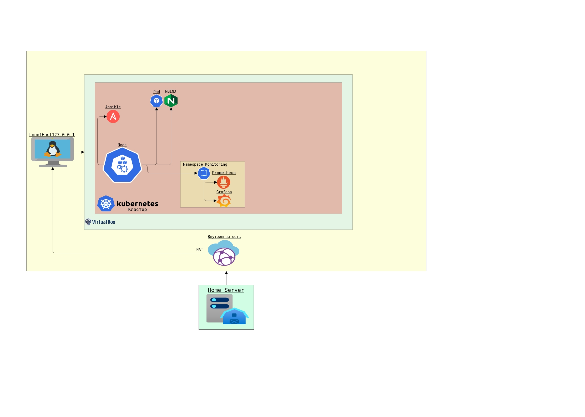

# Архитектура проекта



# Реализация проекта


## :one: Включаем и настраиваем вложенную виртуализацию

1.) Включаем `SVM` в BIOS

2.) Удаляем компоненты Windows:
- `Win` + `R` → `Выполнить` → `appwiz.cpl` → `Enter`
- Переходим в верхний левый раздел и нажмите `Включить или отключить функции Windows`
- Далее снимаем флажок с `Hyper-V`, `Подсистема Windows для Linux` и `Платформа виртуальной машины`

3.) Отключаем безопасность на основе виртуализации:
- `Win` → `cmd` (запускаем от имени администратора)
- Вводим `bcdedit /set hypervisorlaunchtype off`

4.) Включаем вложенную виртуализацию в VMware:
- `Витруальна машина` → `Изменить настройки` → `Процессор` → ☑ Виртуальный Intel VT-x/EPT или AMD-V/RVI

---

## :two: Установка minikube
```bash
$ sudo apt update              # Обновляемся
$ sudo apt upgrade             # Обновляемся
$ sudo apt install docker.io   # Устанавливаем Docker
$ sudo apt install curl        # Устанавливаем курл
$ sudo apt install virtualbox  # Устанавливаем VirtualBox
```

#### Устанавливаем kubectl:
```bash
$ curl -LO "https://dl.k8s.io/release/$(curl -L -s https://dl.k8s.io/release/stable.txt)/bin/linux/amd64/kubectl"  # Загружаем исполняемый файл kubectl
$ sudo install -o root -g root -m 0755 kubectl /usr/local/bin/kubectl  # Устанавливаем исполняемый файл kubectl в директории /usr/local/bin с правами доступа для запуска от root-а
```

#### Устанавливаем Minikube:
```bash
$ curl -LO https://storage.googleapis.com/minikube/releases/latest/minikube-linux-amd64
$ sudo install minikube-linux-amd64 /usr/local/bin/minikube
$ minikube start --driver=docker --force  # Запускаем Minikube
$ minikube start --driver=virtualbox --force  # Или так, если выдало ошибку
$ minikube status  # Проверяем состояние Minikube
$ minikube stop    # Остановить кластер
```

#### Очистка локального состояния:
```bash
$ minikube start   # В таком случае команда minikube start вернёт ошибку: machine does not exist
$ minikube delete  # Чтобы исправить это, нужно очистить локальное состояние
```

#### Установка kubernetes-dashboard:
```bash
$ minikube addons enable dashboard  # Включаем модуль
$ export EDITOR=nano  # Меняем редактор VIM на NANO (чтобы по умолчанию edit использовал редактор nano)
$ kubectl edit service kubernetes-dashboard -n kube-system  # Меняем порт в сервисе, чтобы можно было зайти в UI приложения
Меняем строку type: ClusterIP на type: NodePort
$ minikube ip  # Смотрим ip minikube
$ kubectl get service -A | grep dashboard  # Смотрим порт сервиса
Вставляем в браузер:  # http://<ip_minikube>:<port_service>
```


---

Создание namespace "Monitoring"
```bash
$ kubectl create namespace monitoring
```

Cоздание манифестов для развертывания Prometheus и Grafana в новом namespace
### Prometheus
- Манифест для развертывания Prometheus
```bash
$ nano prometheus.yml
```

- Пишем конфиг пода:
```yml
apiVersion: v1
kind: Service
metadata:
  name: prometheus
  namespace: monitoring
  labels:
    app: prometheus
spec:
  selector:
    app: prometheus
  ports:
    - name: web
      port: 9090
      targetPort: 9090
---
apiVersion: apps/v1
kind: Deployment
metadata:
  name: prometheus
  namespace: monitoring
  labels:
    app: prometheus
spec:
  replicas: 1
  selector:
    matchLabels:
      app: prometheus
  template:
    metadata:
      labels:
        app: prometheus
    spec:
      containers:
        - name: prometheus
          image: prom/prometheus:latest
          ports:
            - containerPort: 9090
          volumeMounts:
            - name: prometheus-storage
              mountPath: /prometheus
      volumes:
        - name: prometheus-storage
          emptyDir: {}
```

```bash
# Делаем чтобы через edit был редактор nano
$ export EDITOR=nano

# Выбираем сервис, который хотим открыть в Web-интерфейсе
$ kubectl get services -n monitoring

# Редактируем конфигурации сервиса (Находим строку type: ClusterIP и меняем на type: NodePort)
$ kubectl edit service prometheus -n monitoring

# Смотрим какой порт присвоился и вставляем minikube ip и порт сервиса в браузер
$ kubectl get service -n monitoring
```


## :three: Запускаем несколько подов `nginx`, `mysql` и `wildfly`. Дополнительно связка `Prometheus Grafana` с помощью чартов

### NGINX
- Создаем конфиг:
```bash
$ nano nginx.yaml
```
- Пишем конфиг пода:
```yml
apiVersion: v1
kind: Pod
metadata:
  name: nginx-pod
spec:
  containers:
  - name: nginx-container
    image: nginx
```
- Запускаем под:
```bash
kubectl apply -f nginx.yaml
```

### WILDFLY
- Создаем конфиг:
```bash
$ nano wildfly.yaml
```
- Пишем конфиг пода:
```yml
apiVersion: v1
kind: Pod
metadata:
  name: wildfly-pod
spec:
  containers:
  - name: wildfly-container
    image: jboss/wildfly
```
- Запускаем под:
```bash
$ kubectl apply -f wildfly.yaml
```

### MYSQL
- Создаем конфиг:
```bash
$ nano mysql.yaml
```
- Пишем конфиг пода:
```yml
apiVersion: v1
kind: Pod
metadata:
  name: mysql-pod
spec:
  containers:
  - name: mysql-container
    image: mysql:8.0
    env:
    - name: MYSQL_ROOT_PASSWORD
      value: {наш пароль}
```
- Запускаем под:
```bash
$ kubectl apply -f mysql.yaml
```

### Prometheus Grafana
- Настройка HELM:
```bash
Используем Helm для развертывания

# Скачивание:
$ wget https://get.helm.sh/helm-v3.9.3-linux-amd64.tar.gz

# Распаковка:
$ tar xvf helm-v3.9.3-linux-amd64.tar.gz

# Перемещаем файл helm в директорию /usr/local/bin:
$ sudo mv linux-amd64/helm /usr/local/bin

# Добавляем новый репозиторий чартов:
$ helm repo add stable https://charts.helm.sh/stable

# Обновляем репозиторий Helm:
$ helm repo update
```
- Установка чартов:
```bash
# Установка чартов Prometheus-community:
$ helm repo add prometheus-community https://prometheus-community.github.io/helm-charts

# Поиск пакета Prometheus в репозитории:
$ helm search repo prometheus-community

# Установка пакета Prometheus (kube-prometheus-stack) из репозитория prometheus-community:
$ helm install prometheus prometheus-community/kube-prometheus-stack

# После установки, проверяем статус Minikube:
$ minikube status
```
- Grafana вход в UI:
```bash
# Смотрим пароль от пользователя admin для Grafana:
kubectl get secret prometheus-grafana -o jsonpath="{.data.admin-password}" | base64 --decode ; echo

# Смотрим ip minikube
$ minikube ip

# Смотрим порт сервиса
$ kubectl get service -A | grep grafana
```
Вставляем в браузер [http://<ip_minikube>:<port_service>](http://<ip_minikube>:<port_service>)

---

## :four: Работа с подами и контейнерами

```bash
# Проверяем состояние подов контейнеров
$ kubectl get po -A
```
```bash
# Смотрим утилизацию контейнеров
$ minikube addons enable metrics-server  # Включаем метрики сервера в кластере
$ kubectl top po  # Смотрим утилизацию по CPU и RAM
```
```bash
# Смотрим логи контейнеров
$ kubectl logs <name_pod>
```
```bash
# Подключение к контейнеру
$ kubectl exec -it nginx-pod -- bash
$ ls -ali  # Проверяем проходят ли команды
```
```bash
# Останавливаем контейнеры
$ minikube stop  # Можем остановить все (Остановка кластера)
$ kubectl delete po nginx-pod  # Остановить контейнеры выборочно
```

---

## :five: Настройка и подключение к сервису через UI
```bash
# Делаем чтобы через edit был редактор nano
$ export EDITOR=nano

# Выбираем сервис, который хотим открыть в Web-интерфейсе
$ kubectl get services -n <namespace>

# Редактируем конфигурации сервиса (Находим строку type: ClusterIP и меняем на type: NodePort)
$ kubectl edit service <name_service> -n <namespace>
```

---


## :six: Собираем свой контейнер используя UBI 7.7 в качестве базового образа
UBI 7.7 - Это образ ОС Linux фактически голый

```bash
# Задача:
1.) С установленным apache (httpd)
2.) Httpd должен запускаться при запуске контейнера
3.) Заменить содержимое домашней страницы HTTPD по умолчанию (/var/www/html/index.html)
4.) Запустить созданный контейнер
5.) Проверить доступность  curl http://....
6.) В результате должно отобразиться содержимое index.html
```

### Решение:
- Создаём `Dockerfile`
```bash
$ nano Dockerfile
```
- Пишем конфиг `Dockerfile`:
```yml
FROM registry.access.redhat.com/ubi7/ubi:7.7

# Устанавливаем apache (httpd)
RUN yum install -y httpd

# Замена содержимого домашней страницы HTTPD по умолчанию
COPY index.html /var/www/html/

# Указываем команду по умолчанию для запуска контейнера
CMD [ "httpd", "-D", "FOREGROUND" ]
```

- Создаём `index.html`
```bash
$ nano index.html
```
- Пишем конфиг `index.html`:
```html
<!DOCTYPE html>
<html>
<head>
    <title>Добро пожаловать в мой сайт</title>
</head>
<body>
    <h1>Sber DevOps success</h1>
    <p>Это моя домашняя страница</p>
</body>
</html>
```

- Создаём наш образ
```bash
$ docker build -t my-apache-image /home/andrey/
```

- Запускаем контейнер на основе нашего образа
```bash
$ docker run -d -p 80:80 my-apache-image
```

Ну и идём в браузер `localhost:80`
Либо курлим: `curl http://localhost:80`

---


